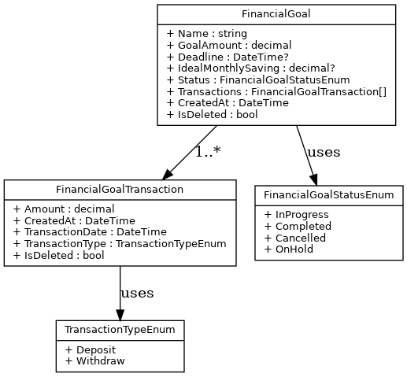

# 💼 FinancialBox - Sistema de Gerenciamento de Metas Financeiras

## 📖 Sobre o Projeto

**FinancialBox** é um sistema de gerenciamento de metas financeiras inspirado no recurso de "Caixinhas" do Nubank. Ele permite que os usuários criem, gerenciem e acompanhem objetivos financeiros de forma eficiente, oferecendo recursos robustos para controle de transações, validação de dados e geração de relatórios.

> 🧑‍🎓 Este projeto está sendo desenvolvido como parte do meu **Trabalho de Conclusão de Curso (TCC)**, com foco na construção de uma aplicação full-stack escalável, bem arquitetada e de fácil manutenção, utilizando práticas modernas de desenvolvimento.

---

## 📘 Visão Acadêmica

### 1. Introdução

A engenharia de software oferece ferramentas e metodologias fundamentais para o desenvolvimento de soluções confiáveis e eficazes. Com o crescimento da demanda por controle financeiro digital, os usuários buscam alternativas práticas para gerenciar seus objetivos. Embora bancos digitais tenham evoluído, ainda são escassas as plataformas acessíveis e personalizáveis com esse propósito.

Entre os recursos mais procurados está o conceito de “caixinhas financeiras”, popularizado por fintechs como o Nubank. No entanto, poucas soluções permitem um gerenciamento completo, que envolva aportes, simulações, acompanhamento e relatórios.

Este projeto visa desenvolver um sistema full-stack de gerenciamento de metas financeiras, com funcionalidades como cadastro, simulação de crescimento, controle de transações, upload de imagem de capa e geração de relatórios.

Para isso, serão realizadas atividades como levantamento de requisitos, modelagem das entidades (caixa, transação), desenvolvimento de uma API com ASP.NET Core, criação da interface com Blazor, validação com FluentValidation, uso de Clean Architecture e persistência de dados com SQLite.

A proposta busca oferecer uma solução moderna, funcional e adaptável à rotina de pessoas que desejam ter maior controle sobre suas finanças pessoais, promovendo disciplina financeira e independência tecnológica.

### 2. Especificações Iniciais do Software

#### 2.1 Escopo do Produto

O sistema será uma aplicação full-stack para gerenciamento de metas financeiras. Permitirá ao usuário criar caixinhas, simular crescimento com aportes e rendimentos, registrar transações, anexar imagens de capa e visualizar relatórios. Toda a lógica será implementada via ASP.NET Core API, com interface em Blazor e banco de dados SQLite com suporte do Entity Framework Core.

#### 2.2 Funcionalidades do Produto

- Cadastro, visualização, edição e exclusão de caixas financeiras;
- Cadastro e listagem de transações vinculadas a cada caixa;
- Simulação de crescimento com base em aportes mensais e rendimentos;
- Upload de imagem de capa para cada caixa;
- Cálculo automático do valor total da caixa via transações;
- Geração de relatórios sobre a evolução das caixas;
- Interface responsiva e interativa via Blazor.

#### 2.3 Ambiente e Tecnologias

O sistema será desenvolvido com **ASP.NET Core** no back-end e **Blazor** no front-end. O banco de dados utilizado será o **SQLite**, com acesso via **Entity Framework Core**. A validação de dados será feita com **FluentValidation**. A arquitetura utilizará os padrões **Repository**, **Unit of Work**, **CQRS** e será baseada em **Clean Architecture**. O ambiente de desenvolvimento será Windows com Visual Studio, e a aplicação será acessada via navegadores modernos.

### 3. Metodologia de Desenvolvimento

Será utilizada a **metodologia ágil**, com aplicação do framework **Scrum**, permitindo entregas incrementais e iterativas, sempre com foco no valor para o usuário.

O projeto será dividido em **sprints curtos**, com definição de metas, backlog priorizado e reuniões de planejamento, revisão e retrospectiva. Ao fim de cada sprint, será entregue uma funcionalidade pronta e testada.

Serão adotadas boas práticas como versionamento de código, testes automatizados, uso de DTOs, arquitetura limpa (Clean Architecture) e princípios **SOLID**, garantindo qualidade e flexibilidade no desenvolvimento.

---

## 🚀 Funcionalidades

### Gerenciamento de Caixas

- Criar, editar, listar, excluir e visualizar objetivos financeiros.
- Simular crescimento com base em aportes mensais e rendimentos.
- Upload de imagem de capa para cada caixa.
- Cálculo automático do valor total da caixa com transações.

### Gerenciamento de Transações

- Criar, excluir, listar e visualizar transações.
- Validação de valores (até duas casas decimais, sem negativos).
- Tipos suportados: `Deposit` e `Withdraw`.

### Relatórios

- Geração de relatórios detalhados com a evolução das caixas financeiras.

---

## 🛠️ Tecnologias e Arquitetura

### Stack

- **ASP.NET Core API**
- **Blazor (WebAssembly)**
- **SQLite** com **Entity Framework Core**

### Arquitetura

- **Clean Architecture**
- **CQRS**
- **Repository Pattern**
- **Unit of Work Pattern**
- **FluentValidation**
- **Middleware** para tratamento de exceções
- **InputModel / ViewModel / DTOs**
- **IEntityTypeConfiguration**
- **Domain Events**
- **Hosted Services**
- **xUnit** para testes automatizados

---

## 📝 Regras de Negócio

### Transações

- Devem conter até duas casas decimais.
- Não podem ser negativas.
- Tipos válidos: `Deposit`, `Withdraw`.

### Caixas

- Status possíveis: `InProgress`, `Completed`, `Canceled`, `OnHold`.
- Pode conter prazo final e contribuição mensal ideal.
- Todas as transações relacionadas devem ser rastreadas.

---

## 📦 Entidades

### Financial Goal (Caixa)

| Property                    | Type         | Description                                         |
|----------------------------|--------------|-----------------------------------------------------|
| `Id`                       | `Guid`       | Identificador único da Caixa.                       |
| `Title`                    | `string`     | Título do objetivo financeiro.                      |
| `TargetAmount`             | `decimal`    | Valor alvo a ser atingido.                          |
| `Deadline`                 | `datetime?`  | Prazo final da meta (opcional).                     |
| `IdealMonthlyContribution`| `decimal?`   | Contribuição mensal recomendada.                    |
| `Status`                   | `enum`       | Status da Caixa.                                    |
| `Transactions`             | `Collection` | Transações associadas à Caixa.                      |
| `CreatedAt`                | `datetime`   | Data de criação.                                    |
| `IsDeleted`                | `bool`       | Indica exclusão lógica (soft delete).               |

### Transaction

| Property           | Type         | Description                                         |
|--------------------|--------------|-----------------------------------------------------|
| `Id`               | `Guid`       | Identificador único da transação.                   |
| `Amount`           | `decimal`    | Valor da transação.                                 |
| `Type`             | `enum`       | Tipo: `Deposit` ou `Withdraw`.                      |
| `TransactionDate`  | `datetime`   | Data da transação (pode ser retroativa).            |
| `CreatedAt`        | `datetime`   | Data de criação do registro.                        |
| `IsDeleted`        | `bool`       | Indica exclusão lógica (soft delete).               |

---

## 🧩 Diagrama UML de Classes

O seguinte diagrama UML representa visualmente as principais classes e enumerações do sistema:

<p align="center">
  
</p>

---

## 🌐 Como Executar o Projeto

### Pré-requisitos
- .NET 10 SDK
- Entity Framework CLI: `dotnet tool install --global dotnet-ef`

### Passos

1. Clone o repositório:
   ```bash
   git clone https://github.com/seuusuario/financialbox.git
   cd financialbox
   ```

2. Restaure as dependências:
   ```bash
   dotnet restore
   ```

3. Execute as migrations para criar o banco SQLite:
   ```bash
   dotnet ef database update --project src/FinancialBox.Infrastructure --startup-project src/FinancialBox.Presentation
   ```

4. Execute a aplicação:
   ```bash
   dotnet run --project src/FinancialBox.Presentation
   ```

5. Acesse a documentação da API: `https://localhost:5001/swagger`
