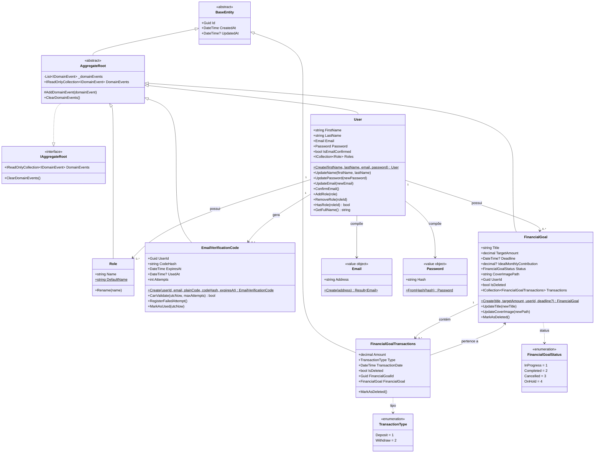

# 💼 FinancialBox - Sistema de Gerenciamento de Metas Financeiras

## 📖 Sobre o Projeto

**FinancialBox** é um sistema de gerenciamento de metas financeiras inspirado no recurso de "Caixinhas" do Nubank. Ele permite que os usuários criem, gerenciem e acompanhem objetivos financeiros de forma eficiente, oferecendo recursos robustos para controle de transações, validação de dados e autenticação segura.

> 🧑‍🎓 Este projeto está sendo desenvolvido como parte do meu **Trabalho de Conclusão de Curso (TCC)**, com foco na construção de uma aplicação back-end escalável, bem arquitetada e de fácil manutenção, utilizando práticas modernas de desenvolvimento.

---

## 📘 Visão Acadêmica

### 1. Introdução

A engenharia de software oferece ferramentas e metodologias fundamentais para o desenvolvimento de soluções confiáveis e eficazes. Com o crescimento da demanda por controle financeiro digital, os usuários buscam alternativas práticas para gerenciar seus objetivos. Embora bancos digitais tenham evoluído, ainda são escassas as plataformas acessíveis e personalizáveis com esse propósito.

Entre os recursos mais procurados está o conceito de "caixinhas financeiras", popularizado por fintechs como o Nubank. No entanto, poucas soluções permitem um gerenciamento completo, que envolva aportes, simulações, acompanhamento e relatórios.

Este projeto visa desenvolver um sistema back-end de gerenciamento de metas financeiras, com funcionalidades como autenticação de usuários, cadastro e controle de caixas financeiras, registro de transações e geração de relatórios.

Para isso, serão realizadas atividades como levantamento de requisitos, modelagem das entidades (usuário, caixa, transação), desenvolvimento de uma API RESTful com ASP.NET Core, validação com FluentValidation, uso de Clean Architecture e persistência de dados com SQLite.

### 2. Especificações Iniciais do Software

#### 2.1 Escopo do Produto

O sistema será uma API RESTful para gerenciamento de metas financeiras. Permitirá ao usuário se cadastrar, autenticar, criar caixinhas, registrar transações, simular crescimento com aportes e rendimentos e visualizar relatórios. Toda a lógica será implementada via ASP.NET Core, com banco de dados SQLite e suporte do Entity Framework Core.

#### 2.2 Funcionalidades do Produto

- Registro e autenticação de usuários com confirmação de e-mail;
- Cadastro, visualização, edição e exclusão de caixas financeiras;
- Cadastro e listagem de transações vinculadas a cada caixa;
- Simulação de crescimento com base em aportes mensais e rendimentos;
- Upload de imagem de capa para cada caixa;
- Cálculo automático do valor total da caixa via transações;
- Geração de relatórios sobre a evolução das caixas.

#### 2.3 Ambiente e Tecnologias

O sistema será desenvolvido com **ASP.NET Core** no back-end. O banco de dados utilizado será o **SQLite**, com acesso via **Entity Framework Core**. A validação de dados será feita com **FluentValidation**. A arquitetura utilizará os padrões **Repository**, **Unit of Work**, **CQRS**, **Outbox** e será baseada em **Clean Architecture**. O ambiente de desenvolvimento será Windows com Visual Studio, e a aplicação será acessada via navegadores modernos ou clientes HTTP.

### 3. Metodologia de Desenvolvimento

Será utilizada a **metodologia ágil**, com aplicação do framework **Scrum**, permitindo entregas incrementais e iterativas, sempre com foco no valor para o usuário.

O projeto será dividido em **sprints curtos**, com definição de metas, backlog priorizado e reuniões de planejamento, revisão e retrospectiva. Ao fim de cada sprint, será entregue uma funcionalidade pronta e testada.

Serão adotadas boas práticas como versionamento de código, testes automatizados, uso de DTOs, arquitetura limpa (Clean Architecture) e princípios **SOLID**, garantindo qualidade e flexibilidade no desenvolvimento.

---

## 🚀 Funcionalidades

### ✅ Implementadas

#### Autenticação

- Registro de usuários com hash seguro de senha.
- Login com geração de JWT Bearer token.
- Confirmação de e-mail via código de verificação.
- Reenvio de código de confirmação.

#### Domínio

- Modelo de `FinancialGoal` (Caixa) com cálculo automático de contribuição mensal ideal.
- Modelo de `FinancialGoalTransactions` (Transação) com soft delete.
- Value Objects: `Email` e `Password`.
- Sistema de `Role` vinculado ao usuário.

### 🔜 Planejadas

- CRUD completo de caixas financeiras via API.
- CRUD de transações via API.
- Upload de imagem de capa para cada caixa.
- Simulação de crescimento com base em aportes mensais.
- Geração de relatórios sobre a evolução das caixas.
- Testes automatizados com xUnit.

---

## 🛠️ Tecnologias e Arquitetura

### Stack

- **ASP.NET Core API** (.NET 10)
- **SQLite** com **Entity Framework Core**
- **MailKit** para envio de e-mails (SMTP)
- **JWT** para autenticação

### Arquitetura e Padrões

- **Clean Architecture**
- **CQRS** com Mediator customizado (sem dependência de MediatR)
- **Repository Pattern**
- **Unit of Work Pattern**
- **Outbox Pattern** para processamento confiável de Domain Events
- **Result Pattern** (`Result<T>`, `Error`, `ErrorType`)
- **FluentValidation** com Pipeline Behavior de validação
- **Value Objects** (`Email`, `Password`)
- **Domain Events**
- **Hosted Services** (Outbox Processor)
- **Interceptors** do EF Core (AuditInterceptor)
- **Middleware** para tratamento global de exceções
- **API Versioning** (v1)
- **IEntityTypeConfiguration** para mapeamento de entidades

---

## 📝 Regras de Negócio

### Transações

- Devem conter até duas casas decimais.
- Não podem ser negativas.
- Tipos válidos: `Deposit`, `Withdraw`.

### Caixas

- Status possíveis: `InProgress`, `Completed`, `Canceled`, `OnHold`.
- Pode conter prazo final e contribuição mensal ideal (calculada automaticamente).
- Todas as transações relacionadas devem ser rastreadas.

### Usuários

- E-mail deve ser confirmado para uso completo da plataforma.
- Senha armazenada com hash seguro.
- Sistema de roles para controle de acesso.

---

## 📦 Entidades

### User (Usuário)

| Property            | Type         | Description                              |
|---------------------|--------------|------------------------------------------|
| `Id`                | `Guid`       | Identificador único.                     |
| `FirstName`         | `string`     | Primeiro nome.                           |
| `LastName`          | `string`     | Sobrenome.                               |
| `Email`             | `Email`      | Value Object de e-mail.                  |
| `Password`          | `Password`   | Value Object de senha (hash seguro).     |
| `IsEmailConfirmed`  | `bool`       | Indica se o e-mail foi confirmado.       |
| `Roles`             | `Collection` | Papéis atribuídos ao usuário.            |

### Financial Goal (Caixa)

| Property                    | Type         | Description                                         |
|-----------------------------|--------------|-----------------------------------------------------|
| `Id`                        | `Guid`       | Identificador único da Caixa.                       |
| `Title`                     | `string`     | Título do objetivo financeiro.                      |
| `TargetAmount`              | `decimal`    | Valor alvo a ser atingido.                          |
| `Deadline`                  | `datetime?`  | Prazo final da meta (opcional).                     |
| `IdealMonthlyContribution`  | `decimal?`   | Contribuição mensal recomendada (calculada auto).   |
| `Status`                    | `enum`       | Status da Caixa.                                    |
| `CoverImagePath`            | `string`     | Caminho da imagem de capa.                          |
| `UserId`                    | `Guid`       | Referência ao usuário dono da caixa.                |
| `Transactions`              | `Collection` | Transações associadas à Caixa.                      |
| `IsDeleted`                 | `bool`       | Indica exclusão lógica (soft delete).               |

### Transaction (Transação)

| Property           | Type         | Description                                         |
|--------------------|--------------|-----------------------------------------------------|
| `Id`               | `Guid`       | Identificador único da transação.                   |
| `Amount`           | `decimal`    | Valor da transação.                                 |
| `Type`             | `enum`       | Tipo: `Deposit` ou `Withdraw`.                      |
| `TransactionDate`  | `datetime`   | Data da transação (pode ser retroativa).            |
| `FinancialGoalId`  | `Guid`       | Referência à caixa vinculada.                       |
| `IsDeleted`        | `bool`       | Indica exclusão lógica (soft delete).               |

---

## 🧩 Diagrama UML de Classes



---

## 🌐 Como Executar o Projeto

### Pré-requisitos

- .NET 10 SDK
- Entity Framework CLI: `dotnet tool install --global dotnet-ef`

### Passos

1. Clone o repositório:

   ```bash
   git clone https://github.com/seuusuario/financialbox.git
   cd financialbox
   ```

2. Restaure as dependências:

   ```bash
   dotnet restore
   ```

3. Execute as migrations para criar o banco SQLite:

   ```bash
   dotnet ef database update --project src/FinancialBox.Infrastructure --startup-project src/FinancialBox.Presentation
   ```

4. Execute a aplicação:

   ```bash
   dotnet run --project src/FinancialBox.Presentation
   ```

5. Acesse a documentação da API: `https://localhost:5001/swagger`
